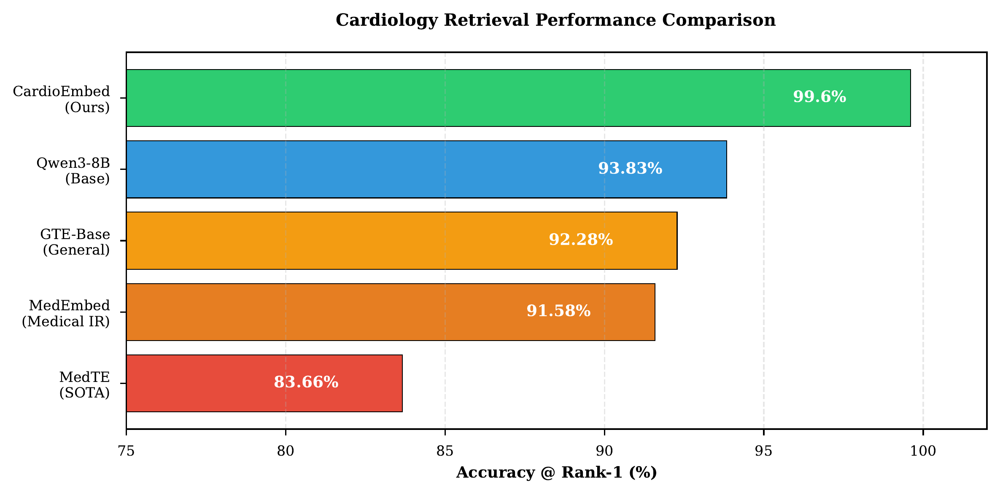

# CardioEmbed: Domain-Specialized Text Embeddings for Clinical Cardiology

<div align="center">

[](https://arxiv.org/abs/2511.XXXXX)
[](https://huggingface.co/richardyoung/CardioEmbed)
[](https://opensource.org/licenses/Apache-2.0)
[](https://www.python.org/downloads/)
[](https://deepneuro.ai)

</div>

---

<div align="center">

**Trained with care by [Richard J. Young](https://deepneuro.ai/richard/)**

*If you find this useful, please star the repo and share with others!*

**Created:** November 2025 | **Format:** LoRA Adapters

</div>

---

**Domain-specialized embedding models trained on comprehensive cardiology textbooks for clinical applications.**

> **Papers:**
> - [CardioEmbed: Domain-Specialized Text Embeddings for Clinical Cardiology](https://arxiv.org/abs/2511.10930) (Original)
> - [Comparative Analysis of LoRA-Adapted Embedding Models](Comparative_Study_Paper/arxiv_paper.pdf) (10-Model Study)
>
> **Authors:** [Richard J. Young](https://deepneuro.ai/richard/)¹, Alice M. Matthews²
>
> **Affiliations:**
> ¹ University of Nevada Las Vegas, Department of Neuroscience
> ² Concorde Career College, Department of Cardiovascular and Medical Diagnostic Sonography

---

## 📄 Overview

### Why CardioEmbed?

Cardiovascular disease remains the **leading cause of death globally**, accounting for approximately **18 million deaths annually** and representing nearly one-third of all mortality worldwide. In the United States alone, cardiovascular disease imposes an estimated annual economic burden exceeding **$400 billion** in direct medical costs and lost productivity.

As machine learning systems increasingly support clinical decision-making in cardiology—from risk stratification and diagnostic assistance to treatment optimization—the quality of semantic text representations becomes critical. However, existing biomedical embedding models trained primarily on PubMed research literature may not fully capture the **procedural knowledge and specialized terminology** found in clinical cardiology textbooks that practitioners actually use.

**CardioEmbed bridges this research-practice gap** by training on comprehensive cardiology textbooks, achieving near-perfect retrieval accuracy on cardiac-specific tasks while maintaining strong performance on general biomedical benchmarks.

### Key Result

CardioEmbed achieves **99.60% retrieval accuracy** on cardiac-specific semantic tasks, a **+15.94 percentage point improvement** over MedTE (the current state-of-the-art medical embedding model).

### Key Features

- **Domain-Specialized Training:** Fine-tuned on 150,000+ sentences from 7 comprehensive cardiology textbooks
- **Clinical Focus:** Captures procedural knowledge, specialized terminology, and clinical reasoning patterns
- **Superior Performance:** Outperforms MedTE, PubMedBERT, and BioBERT on cardiology-specific semantic tasks
- **Efficient Architecture:** LoRA-based fine-tuning on top of various base models
- **Competitive Generalization:** Maintains strong performance on general biomedical benchmarks (BIOSSES, SciFact, NFCorpus)

---

## 🤗 Available Models

We provide **11 LoRA-adapted models** trained on cardiology text, spanning encoder-only and decoder-based architectures:

| Model | Base Model | Separation Score | HuggingFace |
|-------|------------|------------------|-------------|
| **CardioEmbed-BioLinkBERT** | michiyasunaga/BioLinkBERT-large | **0.510** (Best) | [Link](https://huggingface.co/richardyoung/CardioEmbed-BioLinkBERT) |
| **CardioEmbed-Gemma-2-2B** | google/gemma-2-2b-it | 0.455 | [Link](https://huggingface.co/richardyoung/CardioEmbed-Gemma-2-2B) |
| **CardioEmbed-Qwen3-4B** | Qwen/Qwen3-Embedding-4B | 0.446 | [Link](https://huggingface.co/richardyoung/CardioEmbed-Qwen3-4B) |
| **CardioEmbed-MPNet-base** | sentence-transformers/all-mpnet-base-v2 | 0.386 | [Link](https://huggingface.co/richardyoung/CardioEmbed-MPNet-base) |
| **CardioEmbed-Qwen2.5-0.5B** | Qwen/Qwen2.5-0.5B | 0.327 | [Link](https://huggingface.co/richardyoung/CardioEmbed-Qwen2.5-0.5B) |
| **CardioEmbed-BGE-large-v1.5** | BAAI/bge-large-en-v1.5 | 0.314 | [Link](https://huggingface.co/richardyoung/CardioEmbed-BGE-large-v1.5) |
| **CardioEmbed-E5-large-v2** | intfloat/e5-large-v2 | 0.284 | [Link](https://huggingface.co/richardyoung/CardioEmbed-E5-large-v2) |
| **CardioEmbed-BGE-small-v1.5** | BAAI/bge-small-en-v1.5 | 0.250 | [Link](https://huggingface.co/richardyoung/CardioEmbed-BGE-small-v1.5) |
| **CardioEmbed-BGE-M3** | BAAI/bge-m3 | 0.209 | [Link](https://huggingface.co/richardyoung/CardioEmbed-BGE-M3) |
| CardioEmbed-Jina-v2 | jinaai/jina-embeddings-v2-base-en | -0.175 | [Link](https://huggingface.co/richardyoung/CardioEmbed-Jina-v2) |
| **CardioEmbed** (Original) | Qwen/Qwen3-Embedding-8B | - | [Link](https://huggingface.co/richardyoung/CardioEmbed) |

> **Key Finding:** BioLinkBERT (340M params) outperforms models 10x larger. Encoder-only architectures with biomedical pretraining achieve superior domain-specific performance. See our [comparative study paper](Comparative_Study_Paper/arxiv_paper.pdf) for details.

---

## 🚀 Quick Start

### Using the Pre-trained Model

**Model:** [richardyoung/CardioEmbed](https://huggingface.co/richardyoung/CardioEmbed)

```python
from transformers import AutoModel, AutoTokenizer
from peft import PeftModel
import torch

# Load base model and CardioEmbed adapter
base_model = AutoModel.from_pretrained("Qwen/Qwen3-Embedding-8B", trust_remote_code=True)
model = PeftModel.from_pretrained(base_model, "richardyoung/CardioEmbed")
tokenizer = AutoTokenizer.from_pretrained("Qwen/Qwen3-Embedding-8B", trust_remote_code=True)

# Generate embeddings for cardiology text
texts = [
    "Acute myocardial infarction with ST elevation in leads II, III, and aVF",
    "Transthoracic echocardiography shows reduced left ventricular ejection fraction"
]

inputs = tokenizer(texts, return_tensors="pt", padding=True, truncation=True)
with torch.no_grad():
    embeddings = model(**inputs).last_hidden_state[:, -1, :]  # EOS pooling

print(f"Embedding shape: {embeddings.shape}")
# Output: torch.Size([2, 4096])

# Compute similarity
from torch.nn.functional import cosine_similarity
similarity = cosine_similarity(embeddings[0], embeddings[1], dim=0)
print(f"Cosine similarity: {similarity.item():.4f}")
```

---

## 📊 Performance

### Cardiology-Specific Retrieval
| Model | Acc@1 | Acc@5 | MRR | Mean Similarity |
|-------|-------|-------|-----|-----------------|
| **CardioEmbed (Ours)** | **99.60%** | **99.98%** | **0.9976** | **0.909** |
| Qwen3-8B-Base | 93.83% | 99.55% | 0.9665 | 0.886 |
| MedTE | 83.66% | 97.90% | 0.9029 | 0.859 |
| MedEmbed-base | 63.94% | 92.94% | 0.7810 | 0.792 |
| GTE-Base | 58.69% | 89.47% | 0.7305 | 0.783 |

### MTEB Medical Benchmarks
| Model | BIOSSES (Spearman) | SciFact (NDCG@10) | NFCorpus (NDCG@10) |
|-------|-------------------|------------------|-------------------|
| **CardioEmbed** | **0.77** | 0.61 | 0.26 |
| MedTE | 0.74 | **0.65** | **0.30** |
| Qwen3-8B-Base | 0.70 | 0.61 | 0.27 |

*CardioEmbed excels at cardiology-specific tasks while maintaining competitive performance on general biomedical benchmarks.*

### Performance Visualization



*Figure: Comparison of CardioEmbed against state-of-the-art medical and general-purpose embedding models on cardiology retrieval tasks.*

---

## 🏗️ Repository Structure

```
CardioEmbed/
├── 01_merge_paraphrases.py           # Merge paraphrase data for training
├── 02_prepare_training_data.py       # Prepare training triplets
├── 03_train_embedding_model.py       # Main training script
├── 04_evaluate_model.py              # Evaluation on cardiology test set
├── 05_usage_example.py               # Example usage code
├── requirements.txt                  # Python dependencies
├── Final_Published_Paper/            # Original CardioEmbed paper (LaTeX)
│   ├── main.tex
│   ├── bibliography/references.bib
│   └── figures/
└── Comparative_Study_Paper/          # 10-Model Comparative Study (LaTeX)
    ├── arxiv_paper.tex
    ├── arxiv_paper.pdf
    ├── references.bib
    └── figure*.pdf (13 figures)
```

---

## 📚 Training Your Own Model

### Prerequisites

```bash
# Python 3.8+
python --version

# For training: NVIDIA GPU with 16GB+ VRAM
nvidia-smi

# Install dependencies
pip install -r requirements.txt
```

### Training Pipeline

```bash
# 1. Prepare your cardiology training data
python 02_prepare_training_data.py

# 2. (Optional) Generate paraphrases for data augmentation
python 01_merge_paraphrases.py

# 3. Train the embedding model
python 03_train_embedding_model.py

# 4. Evaluate on your test set
python 04_evaluate_model.py
```

### Training Data

**Corpus:** 7 comprehensive cardiology textbooks (legally purchased)
- Braunwald's Heart Disease (11th ed, 2018)
- ESC Textbook of Cardiovascular Imaging (3rd ed, 2021)
- Textbook of Cardiovascular Medicine (2nd ed)
- Echocardiography Review Guide (4th ed, 2019)
- Intraprocedural Imaging of Cardiovascular Interventions (2016)
- Additional specialized cardiology references

**Processing:**
- OCR: DeepSeek-OCR (3B parameter vision-language model)
- Sentence extraction and deduplication
- Final corpus: ~150,000 unique sentences
- Training triplets: 106,386 (anchor, positive, hard negative)

**Note:** Due to copyright restrictions, the processed training corpus cannot be publicly released. All source materials were legally acquired.

---

## 🔬 Training Configuration

### Model Architecture
- **Base:** Qwen3-Embedding-8B (8B parameters, 28 layers)
- **Fine-tuning:** LoRA (rank=16, alpha=32)
- **Embedding:** EOS token pooling
- **Dimensions:** 4096
- **Quantization:** INT8 (base model), FP32 (LoRA adapters)

### Training Hyperparameters
- **Loss:** InfoNCE with in-batch negatives (τ=0.05)
- **Batch size:** 128
- **Learning rate:** 2e-4 (AdamW)
- **Schedule:** 10% linear warmup + cosine annealing
- **Epochs:** 2
- **Hardware:** NVIDIA H100 PCIe (80GB VRAM)
- **Training time:** ~11 hours

---

## 💻 System Requirements

### For Training
- **GPU:** NVIDIA GPU with 16GB+ VRAM (RTX 4090, A100, H100)
- **RAM:** 32GB+ recommended
- **Storage:** 50GB+ for model, data, and checkpoints
- **CUDA:** 11.8+ or 12.x

### For Inference
- **RAM:** 16GB+
- **GPU:** Optional (CPU inference supported, but slower)
- **Storage:** ~20GB (base model + adapter)

---

## 📜 Citation

If you use CardioEmbed in your research, please cite:

```bibtex
@article{young2024cardioembed,
  title={CardioEmbed: Domain-Specialized Text Embeddings for Clinical Cardiology},
  author={Young, Richard J. and Matthews, Alice M.},
  journal={arXiv preprint arXiv:2511.10930},
  year={2024}
}

@article{young2024comparative,
  title={Comparative Analysis of LoRA-Adapted Embedding Models for Clinical Cardiology Text Representation},
  author={Young, Richard J. and Matthews, Alice M.},
  journal={arXiv preprint},
  year={2024}
}
```

---

## 🤝 Contributing

This is a research repository. For questions, issues, or collaboration inquiries:
- **Email:** ryoung@unlv.edu
- **Issues:** Use GitHub Issues for bug reports or feature requests

---

## 📄 License

**Apache License 2.0**

Copyright (c) 2025 Richard J. Young

See [LICENSE](LICENSE) for full details.

---

## 🙏 Acknowledgments

- **Base model:** Qwen Team (Alibaba Cloud) - Qwen3-Embedding-8B
- **OCR:** DeepSeek-AI - DeepSeek-OCR
- **Benchmarking:** MTEB (Massive Text Embedding Benchmark)
- **Computational resources:** NVIDIA H100 GPU infrastructure
- **Open-Source Community:** HuggingFace Transformers, PEFT, bitsandbytes

---

## 🌐 Resources

- 📄 **Original Paper**: [arXiv:2511.10930](https://arxiv.org/abs/2511.10930)
- 📄 **Comparative Study**: [Comparative_Study_Paper/arxiv_paper.pdf](Comparative_Study_Paper/arxiv_paper.pdf)
- 💻 **Code**: [github.com/ricyoung/CardioEmbed](https://github.com/ricyoung/CardioEmbed)
- 🤗 **Models**: [huggingface.co/richardyoung](https://huggingface.co/richardyoung) (11 CardioEmbed variants)
- 🌐 **Website**: [DeepNeuro.AI](https://deepneuro.ai)
- 👤 **Author**: [Richard J. Young](https://deepneuro.ai/richard/)

---

## ⚠️ Important Notes

### Data Ethics
- All textbooks were legally purchased
- Training corpus cannot be shared due to copyright
- Model adapter weights released under Apache 2.0

### Medical AI Disclaimer
This model is intended for **research purposes only**. It should not be used for clinical decision-making without proper validation and oversight by qualified medical professionals.

---

<div align="center">

**Built with ❤️ for advancing medical AI research**

*By [Richard J. Young](https://deepneuro.ai/richard/) & Alice M. Matthews*

[](https://deepneuro.ai)

**Last Updated:** November 2025 | **Status:** Published Research Project

</div>
